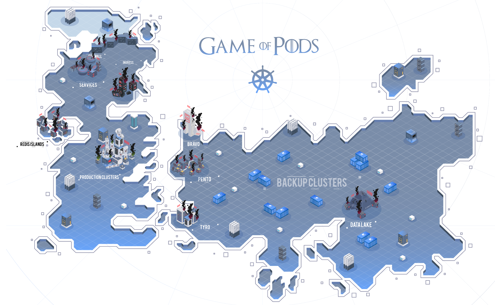

# Kubernetes-use-case

Each directory contains different use case and Its solution to fix it

* [redis use case](redis-use-case)
* [Master server fixing use case](master-fix-use-case)
* [jekyll use case](jelyll-use-case)
* [drupal deployment](drupal-deployment)
* [vote application use case](vote-application-use-case)
* [iron galley use case](iron-galley)

**Master** branch contains README and Architecture diagram

For solution
checkout to **Solution** branch
