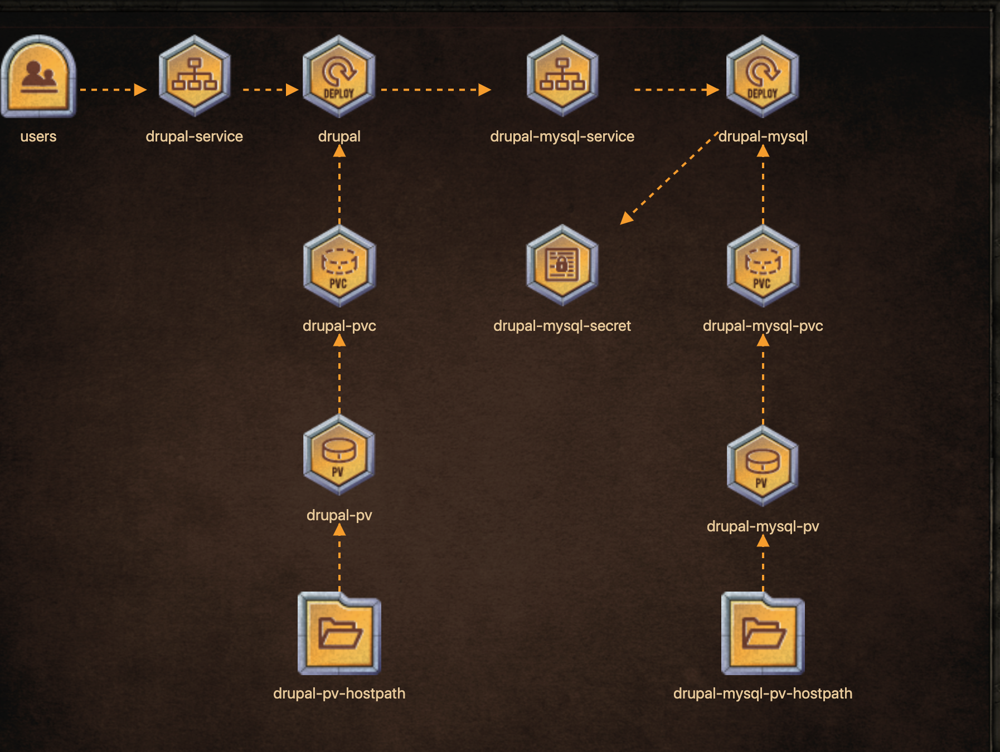

# Drupal deployment case

**Deploy the below architecture for Drupal CMS.**

Click on each icon to see more details. Once done click Check to test your work.

## Users
* Users connect to frontend service: drupal-service

## Drupal deployment

* Deployment Name: drupal
* Replicas: 1
* Image: drupal:8.6
* Deployment has an initContainer, name: 'init-sites-volume'
   * initContainer 'init-sites-volume', image: drupal:8.6
   * initContainer 'init-sites-volume', persistentVolumeClaim: drupal-pvc
   * initContainer 'init-sites-volume', mountPath: /data
   * initContainer 'init-sites-volume', Command: [ "/bin/bash", "-c" ], initContainer: Args: [ 'cp -r /var/www/html/sites/ /data/; chown www-data:www-data /data/ -R' ]
* Deployment 'drupal' uses correct pvc: drupal-pvc
* Deployment has a regular container, name: 'drupal', image: 'drupal:8.6'
  * container: 'drupal', Volume mountPath: /var/www/html/modules, subPath: modules
  * container: 'drupal', Volume mountPath: /var/www/html/profiles, subPath: profiles
  * container: 'drupal', Volume mountPath: /var/www/html/sites, subPath: sites
  * container: 'drupal', Volume mountPath: /var/www/html/themes, subPath: themes
* Deployment: "drupal" running
* Deployment: 'drupal' has label 'app=drupal'

## Drupal service

* frontend service name: drupal-service
* drupal-service configured as NodePort
* drupal-service uses NodePort 30095

## Drupal PV
* Access modes: ReadWriteOnce
* Volume Name: drupal-pv
* Storage: 5Gi

## Drupal PVC
* Claim Name: drupal-pvc
* Storage Request: 5Gi
* Access modes: ReadWriteOnce

## Drupal pv-hostpath

* Configure drupal-pv with hostPath = /drupal-data (create the directory on Worker Nodes)

## Drupal- mysql deployment
* Replicas: 1
* Image: mysql:5.7
* Deployment Volume uses PVC : drupal-mysql-pvc
* Volume Mount Path: /var/lib/mysql, subPath: dbdata
* Deployment: 'drupal-mysql' running

## Drupal-mysql-service
* Type: ClusterIP
* Port: 3306

## Drupal mysql-secret

* Secret Name: drupal-mysql-secret
* Secret: MYSQL_ROOT_PASSWORD=root_password
* Secret: MYSQL_DATABASE=drupal-database
* Secret: MYSQL_USER=root

## Drupal mysql-pv
* Volume Name: drupal-mysql-pv
* Storage: 5Gi
* Access modes: ReadWriteOnce

## Drupal mysql-pvc
* Claim Name: drupal-mysql-pvc
* Storage Request: 5Gi
* Access modes: ReadWriteOnce

## Drupal mysql-pv-hostpath

* Configure drupal-mysql-pv with hostPath = /drupal-mysql-data (create the directory on Worker Nodes)

