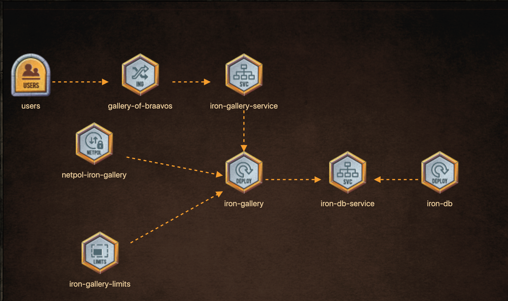

#  Iron Gallery of Bravos

**Deploy the components as per the architecture diagram.**

## iron-galley deployment

* New Deployment, name: 'iron-gallery'
* Image: 'kodekloud/irongallery:2.0'
*  volume, name = config, type: emptyDir
* volume, name = images, type: emptyDir
* volumeMount, name: 'config', mountPath: '/usr/share/nginx/html/data'
* volumeMount, name: 'images', mountPath: '/usr/share/nginx/html/uploads'
* Replicas: 1
* Pod Label: 'run=iron-gallery'

## iron-galley Limits

* Deployment: 'iron-gallery', container has CPU limit: '50m'
* Deployment: 'iron-gallery', container has Memory limit: '100Mi'

## iron-galley service

* Service: 'iron-gallery-service' has 'one' endpoint for pods in deployment 'iron-gallery'?
* targetPort: 80
* port: 80

## Iron-galley ingress service

* Ingress resource configured correctly and application accessible at 'http://iron-gallery-braavos.com:30099/'
* Ingress Resource, name: 'iron-gallery-ingress'
* host: iron-gallery-braavos.com
* http parth: '/'
* http backend serviceName: 'iron-gallery-service'
* Name: ingress-spacehttp backend servicePort: '80'

## iron-galley Network Policy

* NetworkPolicy, name: 'iron-gallery-firewall'
* Ingress Rule - from Pod labeled: 'run=iron-gallery'
* Applied to Pod with label: 'db=mariadb'
* Applied to allow access to port : '3306'

## iron-db deplyment

* New Deployment, name: 'iron-db'
* Image: 'kodekloud/irondb:2.0'
* volume, name = db, type: emptyDir
* volumeMount, name: 'db', mountPath: '/var/lib/mysql'
* Replicas: 1
* env, name: 'MYSQL_ROOT_PASSWORD', value: 'Braavo'
* env, name: 'MYSQL_DATABASE', value: 'lychee'
* env, name: 'MYSQL_USER', value: 'lychee'
* env, name: 'MYSQL_PASSWORD', value: 'lychee'
* Pod Label: 'db=mariadb'

## iron-db service

* Service: 'iron-db-service' has 'one' endpoint for pods in deployment 'iron-db'?
* targetPort: 3306
* Service Port: '3306'

