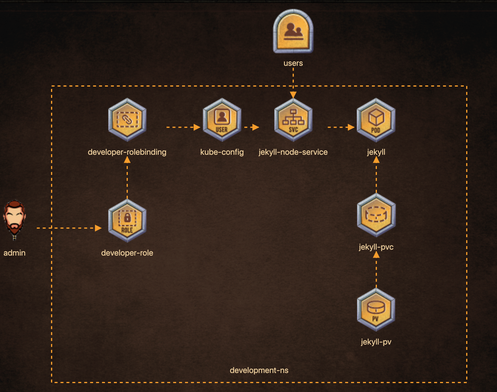

# Deploy the below architecture for implementing a Jekyll SSG.


## Add following to kubeconfig

```
Certificate and key pair for user drogo is created under /root. 
Add this user to kubeconfig = /root/.kube/config, User = drogo, client-key = /root/drogo.key 
client-certificate = /root/drogo.crt
Create a new context in the default config file (/root/.kube/config) called 'developer' with user = drogo and cluster = kubernetes
```
## Create developer role with following permissions
```
'developer-role', should have all(*) permissions for services in development namespace
'developer-role', should have all permissions(*) for persistentvolumeclaims in development namespace
'developer-role', should have all(*) permissions for pods in development namespace
```
## Create Role-binding for above role
```
create rolebinding = developer-rolebinding, 
role= 'developer-role', namespace = development
rolebinding = developer-rolebinding associated with user = 'drogo'
```

## Create POD with following specification
```
pod: 'jekyll' has an initContainer, 
name: 'copy-jekyll-site', image: 'kodekloud/jekyll'
initContainer: 'copy-jekyll-site' command: [ "jekyll", "new", "/site" ] (command to run: jekyll new /site)
pod: 'jekyll', initContainer: 'copy-jekyll-site', mountPath = /site
pod: 'jekyll', initContainer: 'copy-jekyll-site', volume name = site
pod: 'jekyll', container: 'jekyll', volume name = site
pod: 'jekyll', container: 'jekyll', mountPath = /site
pod: 'jekyll', container: 'jekyll', image = kodekloud/jekyll-serve
pod: 'jekyll', uses volume called 'site' with pvc = 'jekyll-site'
pod: 'jekyll' uses label 'run=jekyll'

```

## Expose POD by creating service as follows
```
pod: 'jekyll' has an initContainer, 
name: 'copy-jekyll-site', 
image: 'kodekloud/jekyll'

```

### Create volume clain for already created volume

```
Storage Request: 1Gi
Access modes: ReadWriteMany
pvc name = jekyll-site, namespace development
```
