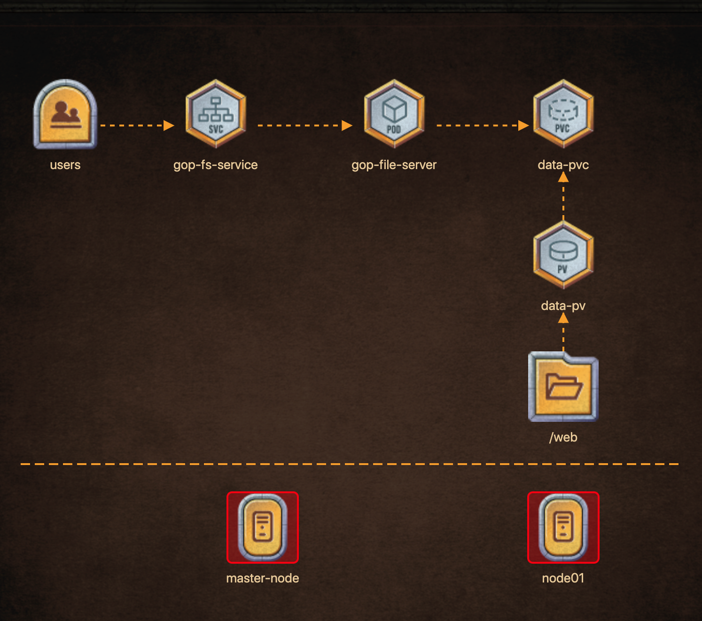

# The Game of Pods cluster is Broken! Troubleshoot, fix the cluster issues and then deploy the below architecture to unlock our Image Gallery!


## Fix the Master node

```
Master node: coredns deployment has image: 'k8s.gcr.io/coredns:1.3.1'
Fix kube-apiserver. Make sure its running and healthy.
kubeconfig = /root/.kube/config, User = 'kubernetes-admin' Cluster: Server Port = '6443'
```

## Fix worker node 
```
node01 is ready and can schedule pods?
```

## Deploy File Server POD with following specs
```
name: 'gop-fileserver'
pod: gop-fileserver image: 'kodekloud/fileserver'
pod: gop-fileserver mountPath: '/web'
pod: gop-fileserver volumeMount name: 'data-store'
pod: gop-fileserver persistent volume name: data-store
pod: gop-fileserver persistent volume claim used: 'data-pvc'
```

## Expose File-server Service as follows:

```
New Service, name: 'gop-fs-service'
Service name: gop-fs-service, port: '8080'
Service name: gop-fs-service, targetPort: '8080'
Service name: gop-fs-service, NodePort: '31200'
```

### Create Persistent Volume as follows:
```
Create new PersistentVolume = 'data-pv'
PersistentVolume = data-pv, accessModes = 'ReadWriteMany'
PersistentVolume = data-pv, hostPath = '/web'
PersistentVolume = data-pv, storage = '1Gi'
node01 has hostPath created = '/web'
 
```
### Claim volume as follows

```
Create new PersistentVolumeClaim = 'data-pvc'
PersistentVolume = 'data-pvc', accessModes = 'ReadWriteMany'
PersistentVolume = 'data-pvc', storage request = '1Gi'
PersistentVolume = 'data-pvc', volumeName = 'data-pv'