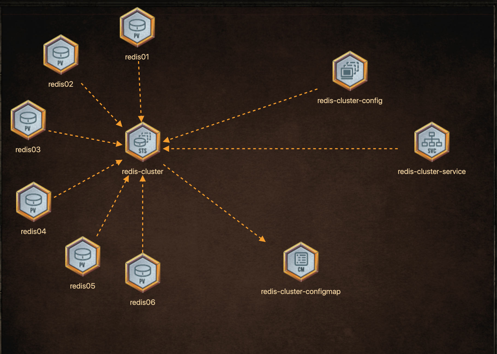

# The Kingdom of Redis Islands needs reinforcement! Build a highly available Redis Cluster based on the below architecture.



## Create StatefulSets with following configuration
```
StatefulSet - Name: redis-cluster
Replicas: 6
Pods status: Running (All 6 replicas)
Image: redis:5.0.1-alpine
container name: redis, command: ["/conf/update-node.sh", "redis-server", "/conf/redis.conf"]
Env: name: 'POD_IP', valueFrom: 'fieldRef', fieldPath: 'status.podIP' (apiVersion: v1)
Ports - name: 'client', containerPort: '6379'
Ports - name: 'gossip', containerPort: '16379'
Volume Mount - name: 'conf', mountPath: '/conf', readOnly:'false' (ConfigMap Mount)
Volume Mount - name: 'conf', mountPath: '/conf', defaultMode = '0755' (ConfigMap Mount)
Volume Mount - name: 'data', mountPath: '/data', readOnly:'false' (volumeClaim)
volumes - name: 'conf', Type: 'ConfigMap', ConfigMap Name: 'redis-cluster-configmap',
volumeClaimTemplates - name: 'data'
volumeClaimTemplates - accessModes: 'ReadWriteOnce'
volumeClaimTemplates - Storage Request: '1Gi'
```

## create Confingmaps with following
__redis.conf__
```
      cluster-enabled yes
      cluster-require-full-coverage no
      cluster-node-timeout 15000
      cluster-config-file /data/nodes.conf
      cluster-migration-barrier 1
      appendonly yes
      protected-mode no
```
__update-node.sh__
```
#!/bin/sh
REDIS_NODES="/data/nodes.conf"
sed -i -e "/myself/ s/[0-9]\{1,3\}\.[0-9]\{1,3\}\.[0-9]\{1,3\}\.[0-9]\{1,3\}/${POD_IP}/" ${REDIS_NODES}
exec "$@"
```
## Create Persistent volumes with following configurations
### redis-01
```
PersistentVolume - Name: redis01
Access modes: ReadWriteOnce
Size: 1Gi
hostPath: /redis01, directory should be created on worker node
```
### redis-02
```
PersistentVolume - Name: redis02
Access modes: ReadWriteOnce
Size: 1Gi
hostPath: /redis02, directory should be created on worker node
```
### redis-03
```
PersistentVolume - Name: redis03
Access modes: ReadWriteOnce
Size: 1Gi
hostPath: /redis03, directory should be created on worker node
```
### redis-04
```
PersistentVolume - Name: redis04
Access modes: ReadWriteOnce
Size: 1Gi
hostPath: /redis04, directory should be created on worker node
```
### redis-05
```
PersistentVolume - Name: redis05
Access modes: ReadWriteOnce
Size: 1Gi
hostPath: /redis05, directory should be created on worker node
```

### redis-06
```
PersistentVolume - Name: redis06
Access modes: ReadWriteOnce
Size: 1Gi
hostPath: /redis06, directory should be created on worker node
```

## Create redis service with following configuration
```
Ports - service name 'redis-cluster-service', port name: 'client', port: '6379'
Ports - service name 'redis-cluster-service', port name: 'gossip', port: '16379'
Ports - service name 'redis-cluster-service', port name: 'client', targetPort: '6379'
Ports - service name 'redis-cluster-service', port name: 'gossip', targetPort: '16379'
```

### Cofigure Cluster 
```
Configure the Cluster. 
Once the StatefulSet has been deployed with 6 'Running' pods, run the below commands and type 'yes' when prompted.
Command: 
kubectl exec -it redis-cluster-0 -- redis-cli --cluster create --cluster-replicas 1 \
$(kubectl get pods -l app=redis-cluster -o jsonpath='{range.items[*]}{.status.podIP}:6379 ')
```
