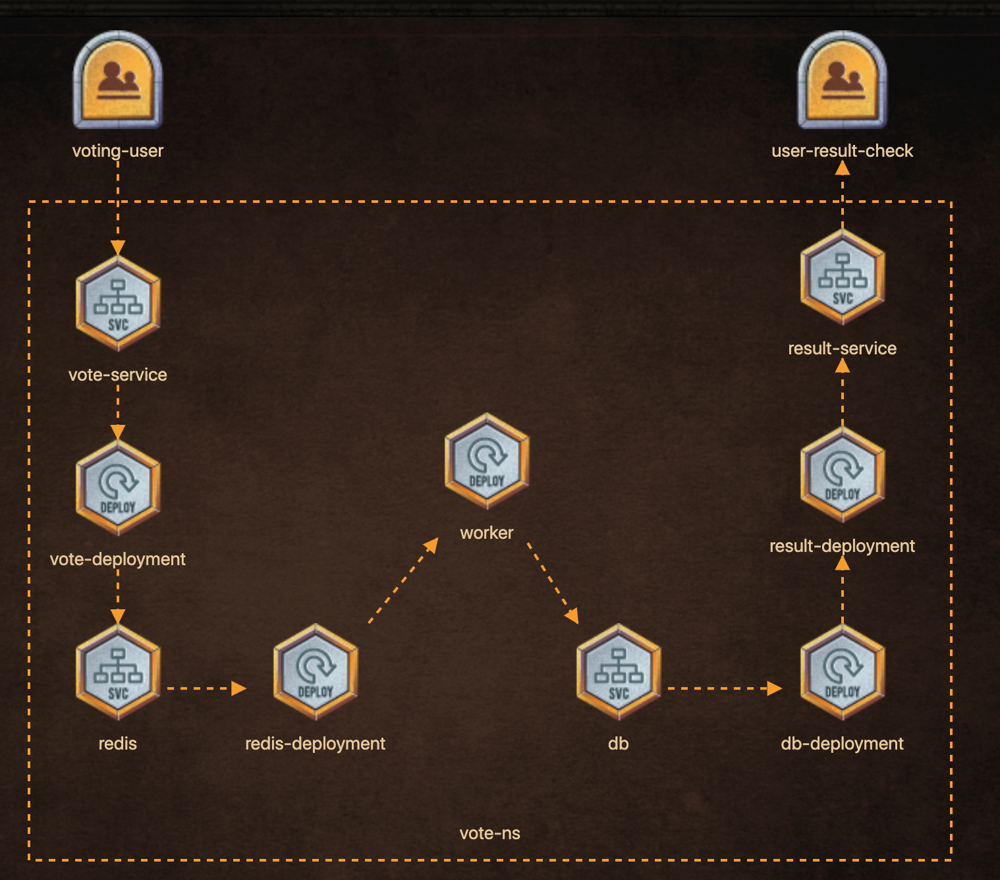

# Voting application

## Deploy the below architecture to vote for the true King of the North!


## Vote deployment

```
Create a deployment: name = 'vote-deployment'
image = 'kodekloud/examplevotingapp_vote:before'
status: 'Running'
```

## Vote service
```
Create a new service: name = vote-service
port = '5000'
targetPort = '80'
nodePort= '31000'
service endpoint exposes deployment 'vote-deployment'
```

## redis deployment

```
Create new deployment, name: 'redis-deployment'
image: 'redis:alpine'
Volume Type: 'EmptyDir'
Volume Name: 'redis-data'
mountPath: '/data'
status: 'Running'
```
## redis service

```
New Service, name = 'redis'
port: '6379'
targetPort: '6379'
type: 'ClusterIP'
service endpoint exposes deployment 'redis-deployment'
```

## db deployment
```
Create new deployment. name: 'db-deployment'
image: 'postgres:9.4'
Volume Type: 'EmptyDir'
Volume Name: 'db-data'
mountPath: '/var/lib/postgresql/data'
status: 'Running'
```

## db service
```
Create new service: 'db'
port: '5432'
targetPort: '5432'
type: 'ClusterIP'
```

## result deployment
```
Create new deployment, name: 'result-deployment'
image: 'kodekloud/examplevotingapp_result:before'
status: 'Running'
```

## result serivice

```
Create new deployment, name: 'result-deployment'
image: 'kodekloud/examplevotingapp_result:before'
status: 'Running'
```

## worker deployment

```
Create new deployment. name: 'worker'
image: 'kodekloud/examplevotingapp_worker'
status: 'Running'
```

```
Vote for the true King of the North here...
Who is the King? See the results here.
```

